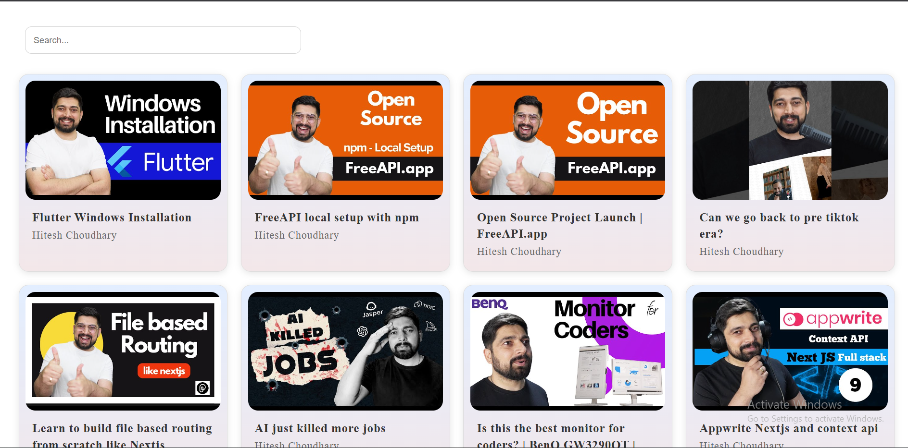

# Youtube Video Listing
 YouTube-style video listing page that fetches and displays videos from the FreeAPI YouTube endpoint

 ## Application Features : 
 1) Fetch data from the api and render the data
 2) On click of the card, the video is opened in youtube on a new tab
 3) Search for the desiered video
 4) Resposive UI

## Tech Stack : 
- HTML
- CSS
- JS

## Screenshots :

## Deployment Url 
### Live Url - 